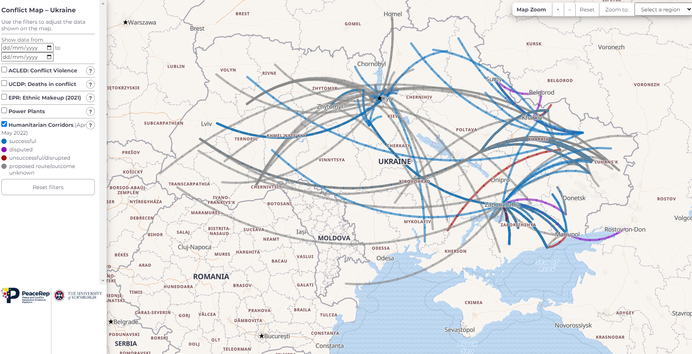

# Humanitarian Corridor Map: Ukraine

## Map Development
This map was designed and developed by Sarah Schöttler for PeaceRep at the University of Edinburgh.  

## Data Sources

The data utilised to represent these humanitarian corridors was manually collected by PeaceRep partners, and manually geocoded to represent the start and end points of the corridors. Please note the lines do not represent any other location data, such as route taken. They only represent the start and end locations. 

## Libraries

Built using the [MapLibre GL JS](https://github.com/maplibre/maplibre-gl-js) library and [Maptiler](https://www.maptiler.com/) vector tiles. Also using [D3](https://d3js.org/).

## Links

-   [MapLibre GL JS API Reference](https://maplibre.org/maplibre-gl-js-docs/api/)
-   [Using MapLibre GL JS with vector tiles from MapTiler Cloud](https://cloud.maptiler.com/maps/bright/maplibre-gl-js)
